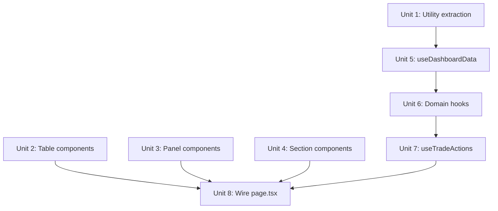

# refactor: Decompose dashboard god hook and monolith page

## Overview

Split the 730-line `useDashboard` god hook into domain-focused hooks and extract the 2053-line `page.tsx` monolith into composable components. This is a pure structural refactor — no behavioral changes. The dashboard continues to look and function identically.

## Problem Frame

Code review findings #20 (P1) and #21 (P1) identified two files that are unmaintainable:

- **`src/app/hooks/useDashboard.ts`** — 730 lines, 30+ state fields, 65 reducer actions, 15 async functions, one massive `useReducer`. Impossible to test any domain in isolation; every dashboard feature change risks touching unrelated state.
- **`src/app/page.tsx`** — 2053 lines, inline PnL calculations, sector concentration logic, stop alignment detection, trade filtering, and 10+ rendering sections all in a single render function. No component reuse possible.

Both files violate single-responsibility and make the dashboard the most fragile surface in the codebase.

## Requirements Trace

- R1. Split `useDashboard` into domain-focused hooks with clear boundaries
- R2. Extract `page.tsx` rendering sections into standalone components
- R3. Move inline business logic out of `page.tsx` into hooks or utilities
- R4. Zero behavioral changes — dashboard renders identically before and after
- R5. Existing 221 tests continue passing throughout refactor

## Scope Boundaries

- No new features, UI changes, or behavioral modifications
- No changes to API routes, data models, or backend logic
- No refactoring of existing extracted components (e.g., `ConfirmModal`, `RegimeBanner`)
- No TypeScript strict mode changes or type refactoring beyond what extraction requires
- Advisory findings #30, #32, #33, #34 are explicitly out of scope

## Context & Research

### Relevant Code and Patterns

- **Existing hook pattern:** `useDashboard.ts` already uses `useReducer` — domain hooks should follow the same `useReducer + useCallback` pattern
- **Existing components:** 21 components already extracted in `src/app/components/` — new components follow the same file naming and export pattern
- **Helpers:** `src/app/components/helpers.ts` has `fmtDate`, `fmtPrice`, `fmtMoney`, `tickerCurrency`, `mono` — reuse these in extracted components
- **Types:** `src/app/components/types.ts` has all shared types (`DashboardData`, `ScanResponse`, `SignalFired`, `SyncResult`, `UINearMiss`)

### Institutional Learnings

- No `docs/solutions/` entries exist yet for this codebase

## Key Technical Decisions

- **Domain hooks share one `DashboardData` fetch:** The `fetchDashboard()` function and its 60s auto-refresh live in a thin `useDashboardData` coordinator hook. Domain hooks receive the data they need as parameters, not by fetching independently. Rationale: avoids duplicate API calls and keeps the single-source-of-truth pattern.
- **Reducer stays per-domain, not one global reducer:** Each domain hook owns its own `useReducer` rather than sharing a single combined reducer. Rationale: domain hooks become independently testable and the 65-action mega-reducer disappears.
- **Component extraction before hook extraction:** Extract components first (Unit 1-4), then split hooks (Unit 5-7), then wire together (Unit 8). Rationale: component extraction is lower-risk and creates the consumer surfaces that define what each domain hook needs to expose.
- **Inline business logic moves to utilities, not hooks:** Closed trade P&L grouping, stop alignment calculation, and runner phase logic become pure functions in `src/lib/` or `src/app/components/helpers.ts`. Rationale: pure functions are trivially testable without React rendering context.

## Open Questions

### Resolved During Planning

- **Q: Should we create a barrel export for the new hooks?** Resolution: No — direct imports are clearer and the hook count is small (5-6 files).
- **Q: Should extracted components receive domain data via props or context?** Resolution: Props. The component tree is shallow enough that prop drilling is clearer than context, and context would add coupling that doesn't exist today.

### Deferred to Implementation

- **Exact prop interfaces for extracted components:** The precise props each component needs will be determined during extraction. The plan identifies which data flows to each component but not the exact TypeScript interface shapes.
- **Whether `closedPerf` memo stays in a component or becomes a utility:** The 87-line memo may be cleanly extractable to `src/lib/trades/performance.ts` or may need React-specific memoization to remain performant. Decide during implementation.

## Implementation Units

- [ ] **Unit 1: Extract inline business logic to utilities**

**Goal:** Move pure calculation logic out of `page.tsx` into testable utility functions.

**Requirements:** R3, R4

**Dependencies:** None

**Files:**
- Create: `src/app/components/dashboardUtils.ts`
- Modify: `src/app/page.tsx` (replace inline logic with utility calls)
- Test: `src/__tests__/app/components/dashboardUtils.test.ts`

**Approach:**
- Extract `closedPerf` computation (lines 108-194) into a `groupAndAggregateClosedTrades()` pure function
- Extract stop alignment calculation (lines 65-94) into `calculateStopAlignment()`
- Extract unrealised PnL calculation into `calculateUnrealisedPnl()`
- Keep `page.tsx` calling these functions — component extraction comes in later units

**Execution note:** Add characterization tests first — snapshot current output for known inputs before extracting.

**Patterns to follow:**
- `src/app/components/helpers.ts` for naming and export style

**Test scenarios:**
- Happy path: `groupAndAggregateClosedTrades([3 closed trades with mixed currencies])` → returns correct grouped structure with running P&L
- Happy path: `calculateStopAlignment({trade with T212 stop matching DB stop within 0.2%})` → returns `"aligned"`
- Edge case: `groupAndAggregateClosedTrades([])` → returns empty groups, zero totals
- Edge case: `calculateStopAlignment({trade with no T212 sync data})` → returns `"unknown"`
- Edge case: `calculateStopAlignment({trade where T212 stop is 5% below DB stop})` → returns `"needs_update"`
- Happy path: `calculateUnrealisedPnl({trade with T212 price, USD ticker, gbpUsd rate 1.27})` → correct GBP-converted P&L

**Verification:**
- All 221 existing tests still pass
- New utility tests cover the extracted functions
- `page.tsx` line count reduced by ~150 lines

---

- [ ] **Unit 2: Extract table components**

**Goal:** Extract the three large table sections from `page.tsx` into standalone components.

**Requirements:** R2, R4

**Dependencies:** Unit 1

**Files:**
- Create: `src/app/components/OpenPositionsTable.tsx`
- Create: `src/app/components/T212PortfolioTable.tsx`
- Create: `src/app/components/TradeHistoryTable.tsx`
- Modify: `src/app/page.tsx` (replace inline JSX with component usage)

**Approach:**
- Each component receives data and action callbacks as props
- Open Positions Table (lines 1130-1625): receives `openTrades`, sync/stop-push callbacks, `syncData`, `expandedTradeId`
- T212 Portfolio Table (lines 1627-1892): receives `t212Positions`, import callbacks
- Trade History Table (lines 2225-2688): receives `closedTrades`, filter state; owns its own local `tradeFilter`/`closedView` state

**Patterns to follow:**
- `src/app/components/ScanHistorySection.tsx` — existing extracted section component with props-based data passing

**Test scenarios:**
- Test expectation: none — pure JSX extraction with no behavioral change. Functional verification via existing dashboard behavior.

**Verification:**
- `page.tsx` line count reduced by ~1200 lines
- Dashboard renders identically (manual visual check)
- All existing tests pass

---

- [ ] **Unit 3: Extract panel and summary components**

**Goal:** Extract the header, P&L summary bar, and action items panel.

**Requirements:** R2, R4

**Dependencies:** Unit 1

**Files:**
- Create: `src/app/components/DashboardHeader.tsx`
- Create: `src/app/components/PnLSummaryBar.tsx`
- Create: `src/app/components/ActionItemsPanel.tsx`
- Modify: `src/app/page.tsx`

**Approach:**
- DashboardHeader (lines 255-328): receives balance, sync state, stop alignment state, callbacks
- PnLSummaryBar (lines 1065-1128): receives openTrades, closedTrades, gbpUsdRate; uses `calculateUnrealisedPnl` from Unit 1
- ActionItemsPanel (lines 394-486): receives actionItems array, action callbacks (sync, stop push, mark done)

**Patterns to follow:**
- `src/app/components/RegimeBanner.tsx` and `src/app/components/EquityCurvePanel.tsx` for banner/panel component shape

**Test scenarios:**
- Test expectation: none — pure JSX extraction with no behavioral change.

**Verification:**
- `page.tsx` line count reduced by ~300 additional lines
- Dashboard renders identically

---

- [ ] **Unit 4: Extract instruction and runner sections**

**Goal:** Extract Daily Instructions and Runner History into standalone components.

**Requirements:** R2, R4

**Dependencies:** Unit 1

**Files:**
- Create: `src/app/components/DailyInstructions.tsx`
- Create: `src/app/components/RunnerHistoryTable.tsx`
- Modify: `src/app/page.tsx`

**Approach:**
- DailyInstructions (lines 488-1060): receives `instructions` array and action callbacks; renders per-instruction-type cards
- RunnerHistoryTable (lines 2690-2760): receives filtered runner trades; self-contained summary stats

**Patterns to follow:**
- Instruction card rendering follows the existing inline pattern — extract as-is, then the inline rendering becomes `<InstructionCard type={...} />` sub-components if warranted during implementation

**Test scenarios:**
- Test expectation: none — pure JSX extraction with no behavioral change.

**Verification:**
- `page.tsx` reduced to ~200-300 lines (layout shell + component composition)
- Dashboard renders identically

---

- [ ] **Unit 5: Create `useDashboardData` coordinator hook**

**Goal:** Extract the data-fetching and auto-refresh logic into a standalone hook that other domain hooks consume.

**Requirements:** R1, R4

**Dependencies:** None (can run parallel with Units 2-4)

**Files:**
- Create: `src/app/hooks/useDashboardData.ts`
- Test: `src/__tests__/app/hooks/useDashboardData.test.ts`

**Approach:**
- Owns `fetchDashboard()`, the 60s auto-refresh interval, and `loading`/`refreshing` state
- Returns `{ data, loading, refreshing, refresh }` — the `refresh` callback is what domain hooks call after mutations
- The auto-sync useEffect (5-min TTL, triggered on openTrades.length change) stays here
- Does NOT own any domain-specific state or actions

**Patterns to follow:**
- Current `useDashboard.ts` fetch + useEffect pattern (lines 340-373)

**Test scenarios:**
- Happy path: Hook fetches `/api/dashboard` on mount and returns data
- Happy path: `refresh()` triggers a re-fetch and updates data
- Edge case: API returns error → `data` stays null, `loading` becomes false
- Integration: 60s interval fires and updates data without user interaction

**Verification:**
- Hook can be mounted independently in a test and returns dashboard data
- Auto-refresh interval works

---

- [ ] **Unit 6: Extract domain hooks (sync, scan, notifications)**

**Goal:** Split `useDashboard` into focused hooks: `usePositionSync`, `useScanRunner`, `useNotifications`.

**Requirements:** R1, R4

**Dependencies:** Unit 5

**Files:**
- Create: `src/app/hooks/usePositionSync.ts`
- Create: `src/app/hooks/useScanRunner.ts`
- Create: `src/app/hooks/useNotifications.ts`
- Test: `src/__tests__/app/hooks/usePositionSync.test.ts`
- Test: `src/__tests__/app/hooks/useScanRunner.test.ts`

**Approach:**
- **`usePositionSync`** owns: `syncingTradeId`, `syncingAll`, `syncData`, `syncProgress`, `lastSyncAt`, `syncPosition()`, `syncAllPositions()`. Receives `refresh` callback from `useDashboardData`.
- **`useScanRunner`** owns: `scanRunning`, `scanResult`, `scanError`, `showConfirm`, `runScan()`. Receives `refresh` callback.
- **`useNotifications`** owns: `errorMsg`, `successMsg`, `exitFlash`, `showError()`, `showSuccess()`, `dismissError()`, `dismissSuccess()`. Pure local state — no API calls.
- Each hook uses its own `useReducer` with only its domain's actions

**Patterns to follow:**
- Current `useDashboard.ts` reducer + useCallback pattern — each hook mirrors the same structure at smaller scale

**Test scenarios:**
- Happy path: `usePositionSync.syncPosition(tradeId)` → calls POST `/api/positions/{tradeId}/sync`, updates syncData
- Edge case: `usePositionSync.syncPosition()` when already syncing → no-op or queues
- Error path: `usePositionSync.syncPosition()` API fails → syncingTradeId cleared, error shown via notifications
- Happy path: `useScanRunner.runScan(true)` → calls GET `/api/scan?dry=true`, returns scanResult
- Error path: `useScanRunner.runScan()` API fails → scanError set, scanRunning cleared
- Happy path: `useNotifications.showError("msg")` → errorMsg set; auto-clears after timeout
- Integration: `syncAllPositions()` detects EXIT instruction → triggers `exitFlash` via notifications hook

**Verification:**
- Each hook can be tested in isolation
- All sync, scan, and notification behaviors work as before

---

- [ ] **Unit 7: Extract `useTradeActions` and `useT212Actions` hooks**

**Goal:** Extract trade entry/exit and T212-specific actions (stop push, import, buy) into focused hooks.

**Requirements:** R1, R4

**Dependencies:** Unit 6

**Files:**
- Create: `src/app/hooks/useTradeActions.ts`
- Create: `src/app/hooks/useT212Actions.ts`
- Test: `src/__tests__/app/hooks/useTradeActions.test.ts`

**Approach:**
- **`useTradeActions`** owns: `placingTicker`, `exitingTradeId`, `exitPrice`, `markPlaced()`, `markExited()`, `updateBalance()`, `balanceInput`, `editingBalance`. Receives `refresh` callback.
- **`useT212Actions`** owns: `pushingStopTradeId`, `pushingStopTicker`, `pendingStopPush`, all stop push functions, `importingTicker`, `importingAll`, `importProgress`, import functions, `buyingSignal`, `buyingTicker`, buy functions. Receives `refresh` callback + `syncAllPositions` from `usePositionSync`.
- Each hook uses its own `useReducer`

**Patterns to follow:**
- Same as Unit 6 — domain-scoped reducer + useCallback

**Test scenarios:**
- Happy path: `useTradeActions.markPlaced(signal)` → calls POST `/api/trades`, refreshes dashboard
- Error path: `useTradeActions.markExited(tradeId)` with invalid exitPrice → shows error via notifications
- Happy path: `useT212Actions.confirmPushStop()` → calls POST `/api/t212/stops/{tradeId}`, refreshes
- Error path: `useT212Actions.confirmBuy()` API fails → clears buying state, shows error
- Edge case: `useT212Actions.importAllT212Positions()` with 0 untracked positions → shows success with "0 imported"

**Verification:**
- Each hook testable in isolation
- Trade entry/exit, stop push, import, and direct buy all work as before

---

- [ ] **Unit 8: Wire `page.tsx` to use new hooks and components**

**Goal:** Replace the monolithic `useDashboard()` call with the new domain hooks and replace inline JSX with extracted components. Delete the old `useDashboard.ts`.

**Requirements:** R1, R2, R3, R4, R5

**Dependencies:** Units 2, 3, 4, 7

**Files:**
- Modify: `src/app/page.tsx` (rewrite to compose new hooks + components)
- Delete: `src/app/hooks/useDashboard.ts`

**Approach:**
- `page.tsx` becomes a ~150-200 line layout shell that:
  1. Calls `useDashboardData()` for data + refresh
  2. Calls `usePositionSync(refresh)`, `useScanRunner(refresh)`, `useNotifications()`, `useTradeActions(refresh)`, `useT212Actions(refresh, syncAll)`
  3. Calls utility functions from Unit 1 for derived values
  4. Composes extracted components from Units 2-4, passing props from hooks
- Verify every exported property from old `useDashboard` is sourced from a new hook
- Delete `src/app/hooks/useDashboard.ts` only after all consumers are migrated

**Patterns to follow:**
- Next.js page component pattern — thin page that composes hooks and components

**Test scenarios:**
- Integration: Full dashboard renders with all hooks composed — visual parity with pre-refactor state
- Integration: Scan → signal → trade placement workflow completes end-to-end through composed hooks
- Integration: Position sync → exit flash → instruction update flows through composed hooks

**Verification:**
- `page.tsx` is under 250 lines
- `useDashboard.ts` is deleted
- All 221+ tests pass
- Dashboard renders identically (manual visual check)
- No console errors or warnings in development mode

## System-Wide Impact

- **Interaction graph:** Only `page.tsx` consumes `useDashboard`. No other pages or components import it. The refactor is fully contained within the dashboard surface.
- **Error propagation:** No change — each domain hook's error handling mirrors the original reducer cases.
- **State lifecycle risks:** The 60s auto-refresh interval must be owned by exactly one hook (`useDashboardData`). During migration, verify no duplicate intervals are created.
- **API surface parity:** No API changes. All fetch calls remain identical.
- **Integration coverage:** The hook composition in `page.tsx` is the critical integration point — verify that cross-hook interactions (e.g., sync triggers refresh, buy triggers sync) still work.
- **Unchanged invariants:** All 20+ API routes, the Prisma schema, the T212 client, cruise-control engine, and all backend logic are untouched.

## Risks & Dependencies

| Risk | Mitigation |
|------|------------|
| State coupling between hooks is missed during decomposition | Map every cross-domain interaction (e.g., sync→refresh, buy→sync→refresh) before splitting and verify each one works after extraction |
| Component prop interfaces become unwieldy | Keep props focused on data + callbacks; if a component needs 10+ props, reconsider the extraction boundary |
| Reducer action names collide across hooks | Each hook's reducer is fully isolated — no shared context or dispatch |
| Visual regression in dashboard after component extraction | Manual visual comparison at each unit boundary; consider screenshot comparison if available |

## Documentation / Operational Notes

- No operational impact — this is a code-only refactor with no runtime behavior change
- After completion, update `SYSTEM_BREAKDOWN.md` if it references the monolith structure

## Sources & References

- Review findings #20, #21 from full codebase review (April 2026)
- Related code: `src/app/hooks/useDashboard.ts`, `src/app/page.tsx`, `src/app/components/`
